# facai网安工具

发财网安工具，都发财，谁用谁发财，你只负责点点点，其他都交给它。

### 介绍

首先周知现在是ai时代了，为什么做这玩意，ai时代传统安全已经死了，这也是个事实，但是，如之前我公众号文章所写。

在当前地球文明中我们要服务两个客户: 

1. 人类
2. AI

因为现在就这两种客户在用，所以我们做软件，要人类和AI都能看得懂，用的了。

Json是个很好的格式，无论是人类还是ai都能读懂，也符合当下AI-Agent的标准。

所以该工具就是基于HTTP请求，并且是json格式的HTTP请求:

```
{
  "url": "https://a.molun.com/auth/getAuthCodeInfoByCode",
  "headers": {
    "accept": "application/json, text/plain, */*",
    "content-type": "application/x-www-form-urlencoded",
    "user-agent": "Mozilla/5.0...",
    "cookie": "auth_sid=20000"
  },
  "method": "POST",
  "body": "code=1&client_id=65407",
  "time": "2025-11-14 17:20:26",
  "website": "http://a.molun.com/",
  "status": 0,
  "scaner_status":0,
  "source": 0  // 0=流量捕捉, 1=url生成
}
```

一切以处理HTTP请求为标准，也就是说通过获取HTTP请求，来分离出，website站点、subdomain子域名，再得到子域名解析记录，再得到HTTP响应，包括html\js\各类响应信息等。

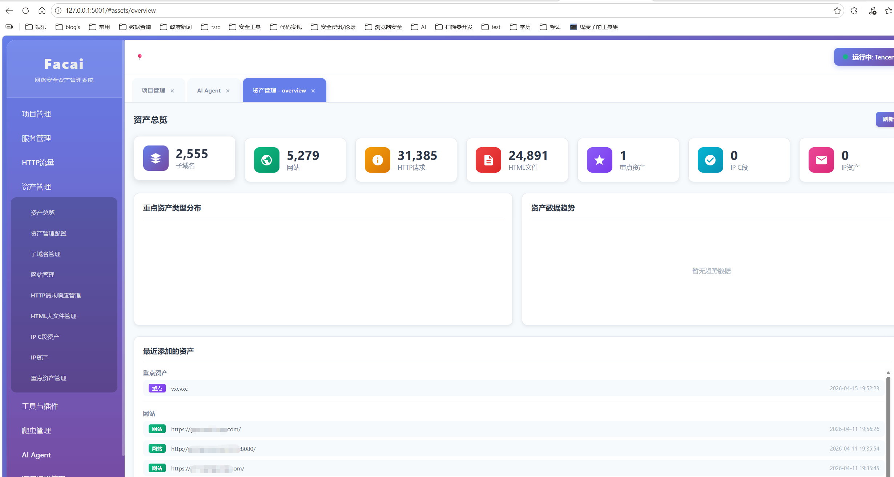

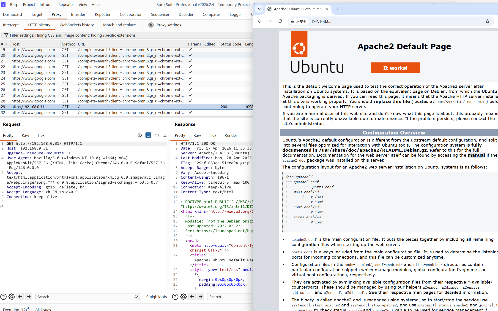

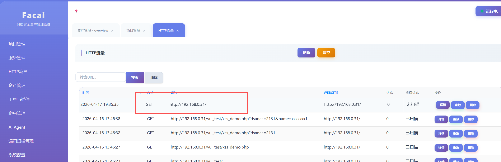

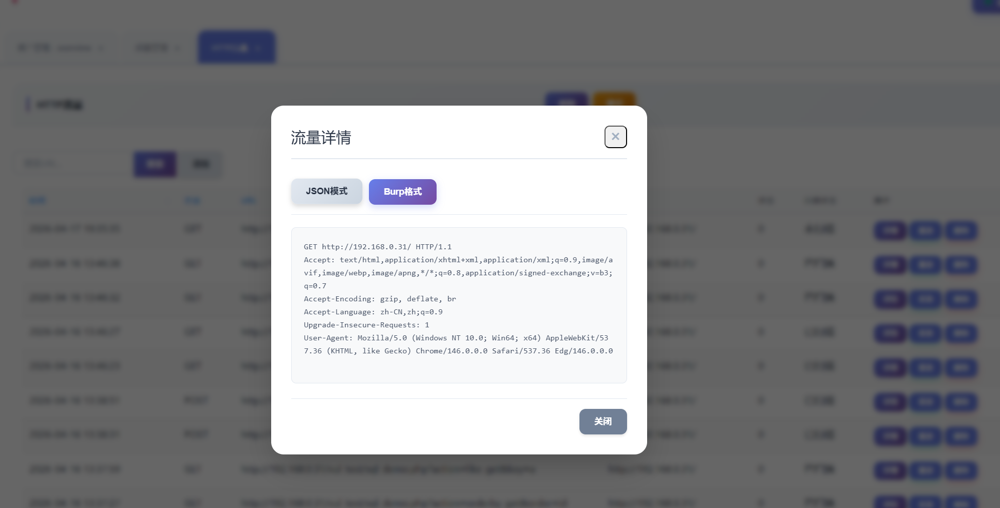

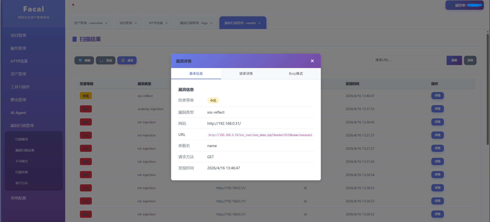

支持对http请求进行处理分离，并且处理读取html，还会对http进行漏洞扫描，并且扫描是无害化，不打任何payload，虽然有不少误报，但将就能用。

1. 资产管理工具
2. 被动漏洞扫描器


### 使用方式

**需要环境**

1. Windows系统
2. mongodb数据库
3. python3+

**安装依赖**

```pip install -r requirements.txt```

**配置文件**config.json

```
{
    "flask_port":5001,
    "chrome_path": "C:\\Program Files\\Google\\Chrome\\Application\\chrome.exe",
    "burp_path": "D:\\hack_tools\\burp\\",
    "chrome_cdp_port": 19227,
    "chrome_spider_cdp_port": 19228,
    "mitmproxy_port": 18081,
    "burp_port":8080,
    "mongodb": {
        "ip": "127.0.0.1",
        "port": 27017,
        "dbname": "facai",
        "username": "",
        "password": ""
    },
    "AI_model":{
        "model_name":"",
        "API":"",
        "API_KEY": ""
    }
}
```

这里的burp_path有个前提，我burp是破解版的，如果你不是，你可以不用填写，burp_path、burp_port。

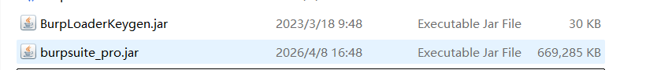

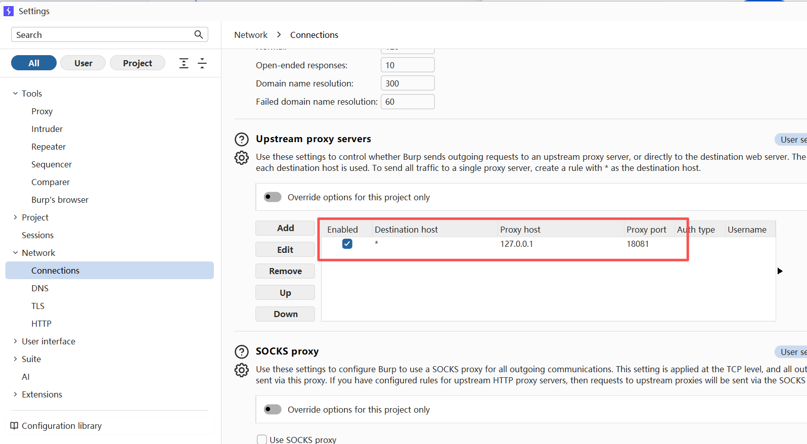

如图自行打开，然后设置burp转发端口，指向为mitmproxy_port端口。

**启动**

```
start.bat
```

**添加项目**

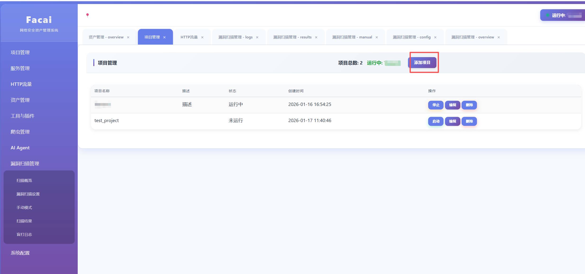

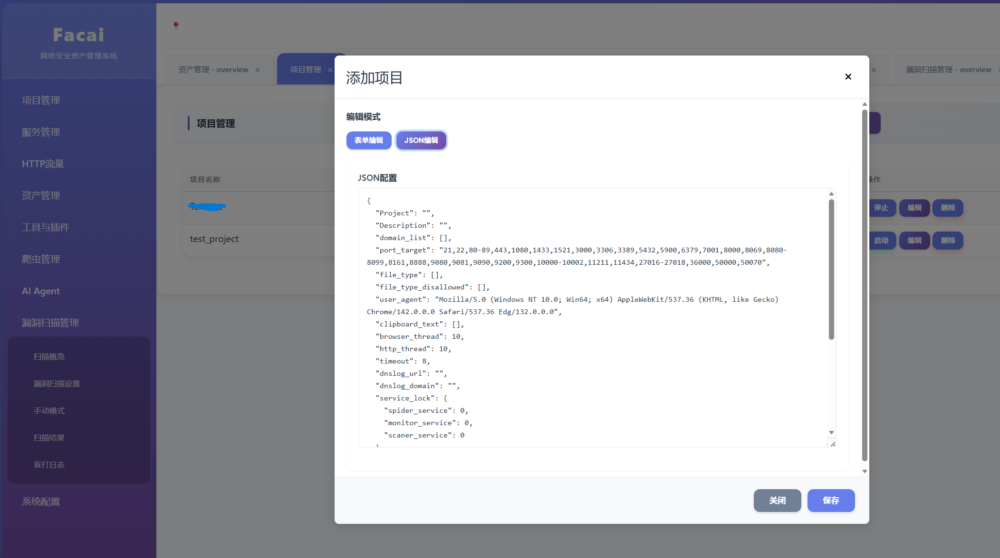

```
{
    "Project": "test",
    "Project_Name": "molun",
    "Description": "描述",
    "domain_list": [
        "lulun.com",
        "molun.com"
    ],
    "port_target": "21,22,80-89,443,1080,1433,1521,3000,3306,3389,5432,5900,6379,7001,8000,8069,8080-8099,8161,8888,9080,9081,9090,9200,9300,10000-10002,11211,11434,27016-27018,36000,50000,50070",
    "clipboard_text": [
        "'\"","javascript:alert``//",""
    ],
    "dnslog_domain":"{hash}.www.dnslog.com",
    "dnslog_url":"http://www.dnslog.com/{hash}",
    "browser_thread": 10,
    "http_thread": 10,
    "user_agent": "Mozilla/5.0 (Windows NT 10.0; Win64; x64) AppleWebKit/537.36 (KHTML, like Gecko) Chrome/146.0.0.0 Safari/537.36 Edg/146.0.0.0",
    "timeout": 8,
    "service_lock": {
      "spider_service": 1,
      "monitor_service": 0,
      "scaner_service": 1
    },
    "dns_server": [
        [
            "119.29.29.29",
            "119.28.28.28"
        ],
        [
            "180.76.76.76",
            "180.76.76.76"
        ],
        [
            "180.184.1.1",
            "180.184.2.2"
        ],
        [
            "114.114.114.114",
            "114.114.115.115"
        ],
        [
            "223.5.5.5",
            "223.6.6.6"
        ]
    ],
    "file_type": [".php", ".asp", ".aspx", ".asa", ".assh", ".jsp", ".jspx", ".do", ".action", ".py", ".cgi", ".htm", ".html", ".fcg", ".fcgi", ".xhtml", ".shtml", ".shtm", ".rhtml", ".rhtm", ".jhtml", ".jhtm", ".pl", ".php3", ".php4", ".php5", ".phtml", ".pht", ".phar", ".phpt", ".phs", ".ph7"],
    "file_type_disallowed": [".3g2", ".3gp", ".7z", ".aac", ".abw", ".aif", ".aifc", ".aiff", ".arc", ".au", ".avi", ".azw", ".bin", ".bmp", ".bz", ".bz2", ".cmx", ".cod", ".csh", ".css", ".csv", ".doc", ".docx", ".eot", ".epub", ".gif", ".gz", ".ico", ".ics", ".ief", ".jar", ".jfif", ".jpe", ".jpeg", ".jpg", ".m3u", ".mid", ".midi", ".mjs", ".mp2", ".mp3", ".mp4", ".mpa", ".mpe", ".mpeg", ".mpg", ".mpkg", ".mpp", ".mpv2", ".odp", ".ods", ".odt", ".oga", ".ogv", ".ogx", ".otf", ".pbm", ".pdf", ".pgm", ".png", ".pnm", ".ppm", ".ppt", ".pptx", ".ra", ".ram", ".rar", ".ras", ".rgb", ".rmi", ".rtf", ".snd", ".svg", ".swf", ".tar", ".tif", ".tiff", ".ttf", ".vsd", ".wav", ".weba", ".webm", ".webp", ".woff", ".woff2", ".xbm", ".xls", ".xlsx", ".xpm", ".xul", ".xwd", ".zip", ".exe", ".apk", ".msi", ".dmg", ".rpm", ".deb", ".pkg", ".ios", ".iso", ".txt", ".m3u8", ".tgz", ".md", ".xml", ".dll"],
    "personal_info":{"id_card_number":"110105199503151234","passport_number":"E12345678","marital_status":"未婚","account":"zhangsan_2024","password":"P@ssw0rd!2024","name":"张三","nickname":"三儿","gender":"男","age":28,"birthday":"1995-03-15","signature":"热爱编程与旅行","email":"zhangsan@example.com","phone":"13800138000","landline":"010-12345678","address":"北京市朝阳区建国路88号SOHO现代城A座1001室","postal_code":"100022","website_url":"https://zhangsan.github.io","emergency_contact":{"name":"张建国","relationship":"父亲","phone":"13900139000"},"school":"北京大学","education_level":"硕士","major":"计算机科学","graduation_time":"2019-07-01","company":"膜沦科技有限公司","occupation":"软件工程师","position":"高级开发工程师","industry":"互联网","work_experience_years":5,"country":"中国","province":"北京市","city":"北京市","district":"朝阳区","hobbies":["编程","旅行","摄影"],"languages":["中文","英语"],"avatar":"https://example.com/avatars/zhangsan.jpg","social_media":{"wechat":"zhangsan_2024","qq":"123456789","weibo":"@张三的微博","linkedin":"linkedin.com/in/zhangsan"},"agreed_to_terms":true,"subscription_preferences":{"receive_marketing_emails":false,"receive_sms_notifications":true}}
    "status_code": 1,
    "created_at": "2026-01-16 16:54:25",
    "updated_at": "2026-02-25 16:21:12"
}
```

1. Project为项目标识，必须纯英文。
2. domain_list为目标范围，必须域名。
3. dnslog_domain、dnslog_url为rce与ssrf盲打的测试url，你可以自行填写，hash是标识符，方便到时候查询是哪个请求打的。
4. personal_info自行更改，之后爬虫会用到。

**启动项目后则可用，因为流量表里没数据，得开浏览器代理指向代理端口往里面写数据，或者在资产管理、资产管理配置导入子域名或者url，写初始启动数据。**

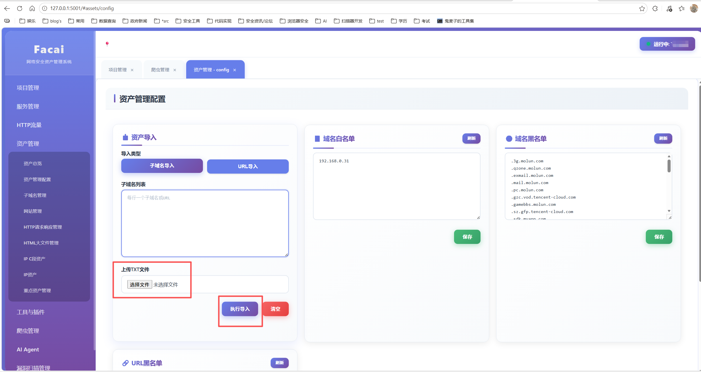


### 功能介绍

```
├── 项目管理                    (#projects)
├── 服务管理                    (#services)
├── HTTP流量                    (#traffic)
├── 资产管理                    (#assets)
│   ├── 资产总览                (#assets/overview)
│   ├── 资产管理配置            (#assets/config)
│   ├── 子域名管理              (#assets/subdomains)
│   ├── 网站管理                (#assets/websites)
│   ├── HTTP请求响应管理        (#assets/http)
│   ├── HTML大文件管理          (#assets/html)
│   ├── IP C段资产              (#assets/ip-cidr)
│   ├── IP资产                  (#assets/ip)
│   └── 重点资产管理            (#assets/highlights)
├── 工具与插件                  (#tools)
│   ├── HTTP请求重放            (#tools/replay)
│   ├── 编码解码                (#tools/encode-decode)
│   └── 端口扫描                (#tools/port-scan)
├── 爬虫管理                    (#spider)
├── AI Agent                    (#ai-agent)
├── 漏洞扫描管理                (#scaner)
│   ├── 扫描概览                (#scaner/overview)
│   ├── 漏洞扫描设置            (#scaner/config)
│   ├── 手动模式                (#scaner/manual)
│   ├── 扫描结果                (#scaner/results)
│   └── 盲打日志                (#scaner/logs)
└── 系统配置                    (#system)
```

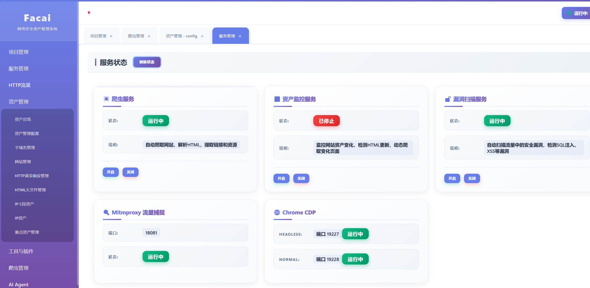

**爬虫服务**:

在启动爬虫服务的情况下会持续对目标范围域名进行信息收集。

具体流程:

1. 检查 `traffic`、`html`、`website` 表是否有待处理数据
2. 如果有数据，执行处理流程：
   - 获取未处理的流量数据
   - 子域名收集 → `subdomain` 表
   - 站点收集 → `website` 表 + `html` 表
   - HTTP 请求重放 → `http` 表 + `html` 表
   - 动态爬虫 → `traffic` 表 + `html` 表
   - HTML URL 提取 → `traffic` 表
3. 如果没有数据，睡眠10秒后继续检查


**资产监控**

启动资产监控会暂停爬虫服务，资产监控重新爬取已有站点数据，发现业务变化与新增，把新增与变化业务时间设为最近，以表示是新业务。


**漏洞扫描服务**

读取流量表，HTTP请求，导入开始漏洞扫描。采用**无害化检测策略**，不发送恶意payload，只做基础安全检测。

默认执行:

1. 异常参数检测
2. xss漏洞检测
3. sql注入检测
4. ssrf检测
5. rce检测


**资产管理功能介绍**

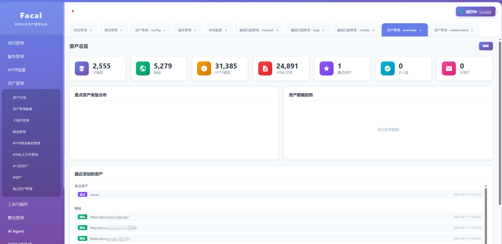

也就是子域名、网站、http请求、html文件、重点资产这些比较常规的显示。


**资产管理配置**

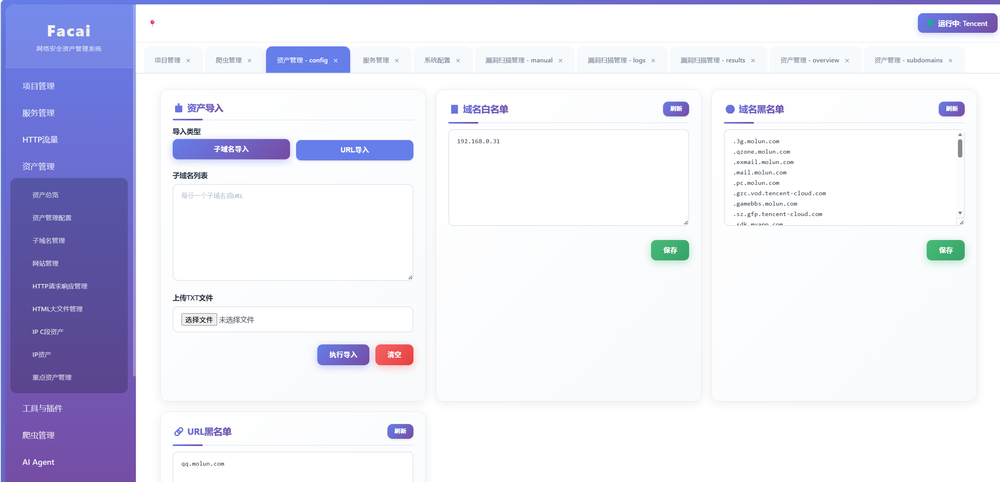

这个需要自己更改，

1. 导入资产，子域名与url。
2. 域名白名单，这个比如 *.qzone.cc.com， 这都是泛解析，但具体的功能是有意义的，但只是泛解析太过重复，其实只用1.qzone.cc.com一个就覆盖了多数功能，其他的泛解析就没必要保存，这种场景情况是很多的，比如某宝主域，大部分是泛解析，但admin、login这种前缀，需要保存下，这就是白名单的作用。
3. 域名黑名单，这个是自动的，不需要手动设置，除非你想屏蔽某个域名，自己手动加。
4. url黑名单，有些url我的自动泛化去重，属实很难覆盖，就需要手动设置下。


**工具与插件**

**HTTP请求重放**

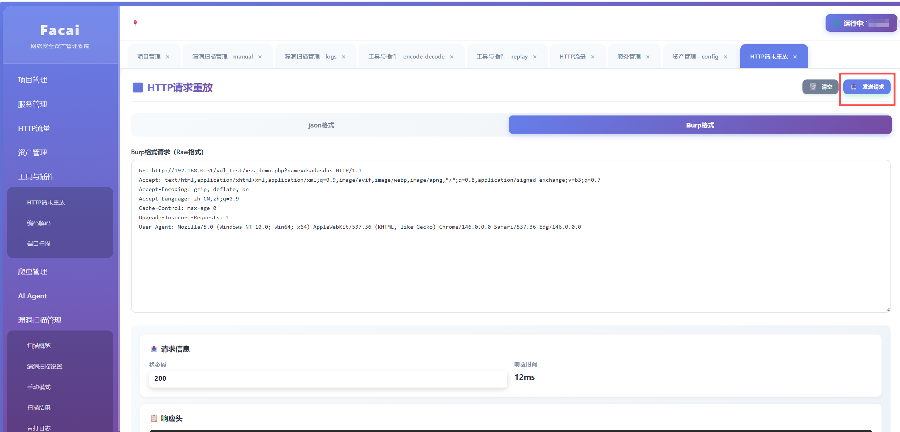

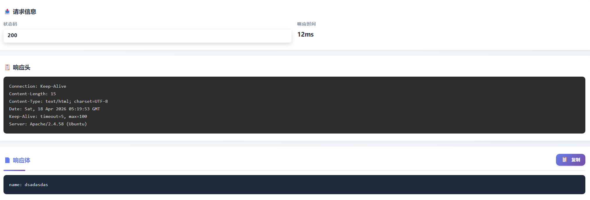

支持json与burp格式，通过HTTP流量的每条数据的重放按钮可以进行一键切过来重放。

**编码解码**

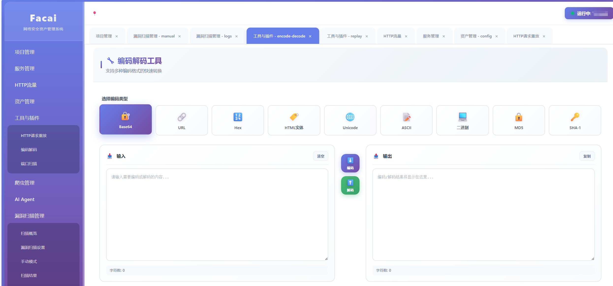

常见的编码解码功能。


### 漏洞扫描管理

**扫描概览**

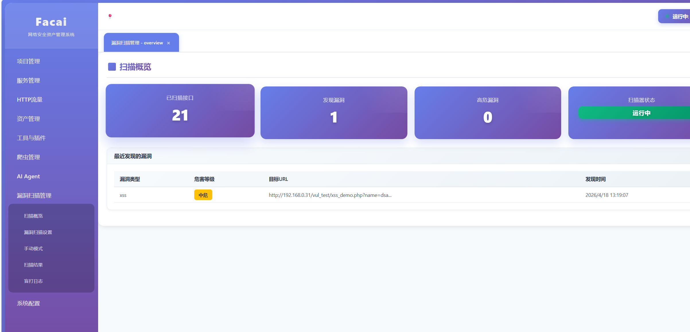

已扫描接口，代表对自动化扫描的会自动去重，避免重复扫描接口和参数。

**漏洞扫描设置**

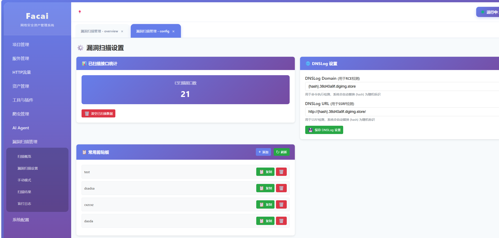

1. 已扫描接口，代表对自动化扫描的会自动去重，避免重复扫描接口和参数。
2. dnslog设置，就是扫描ssrf与rce，ssrf扫描就是替换参数值类型是url的值，进行重放，rce是无危害payload进行闭合命令注入，进行每个参数盲打测试，最终结果，自行看你的服务端dnslog记录。
3. 常用剪贴板，比如你常用的payload，资料、都可以放这，一键复制，便于安全测试使用。

**漏洞扫描手动模式**

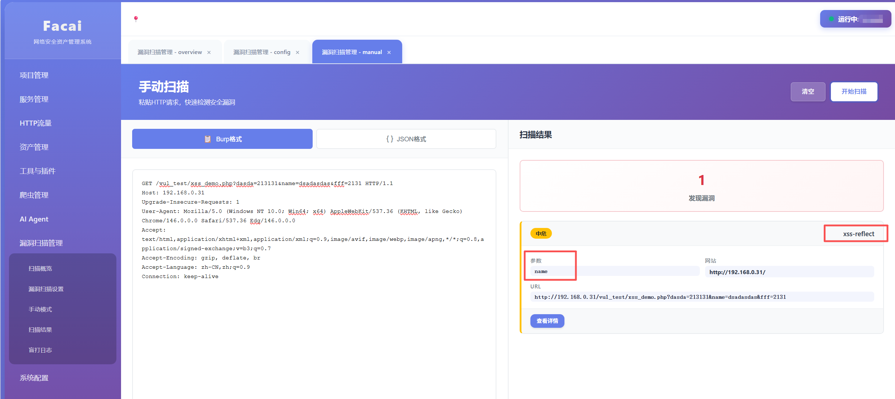

对指定的HTTP请求进行安全检测，无害化检测，并且是低请求包，无害不打扰。

**扫描结果**

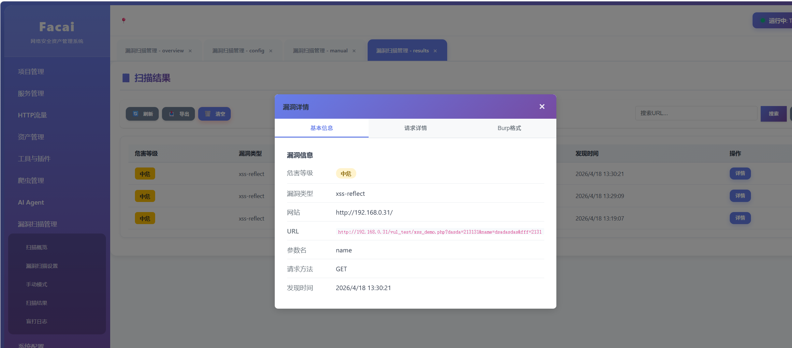

**盲打日志**

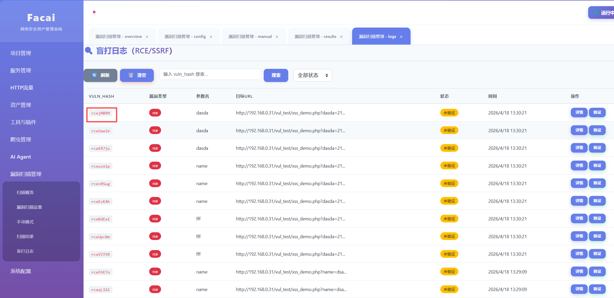

如果你的dnslog有反应，可以通过本工具的vuln_hash字段，查询具体是哪个请求打出的数据。


### 爬虫管理

Free版待建

### AI Agent

Free版待建

### 总结

**总归一句话，你正常chrome浏览网页，甚至说你把某软件的http流量转发过来，xss\sql\ssrf\rce都在后台自动检测，你设置的域名范围内资产也都一块收集了。**

发财，都发财，爬虫与AI功能暂不开放。

技术交流、pro版、定制魔改，作者联系方式wechat: guimaizi

**本项目仅供学习和研究使用，请勿用于非法用途。**

### 欢迎打赏


